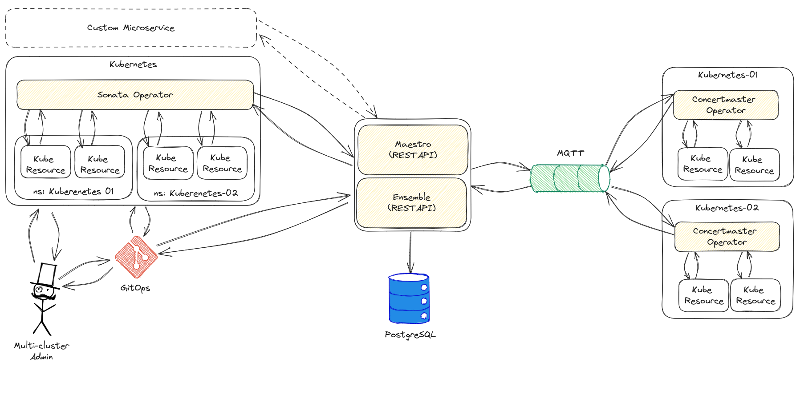

# Ensemble

Emsemble is a component of the Kube Orchestra Project, a multi-cluster resources orchestrator for Kubernetes.

Emsemble is the API for multi-cluster resources definition.

## Kube Orchestra Architecture

